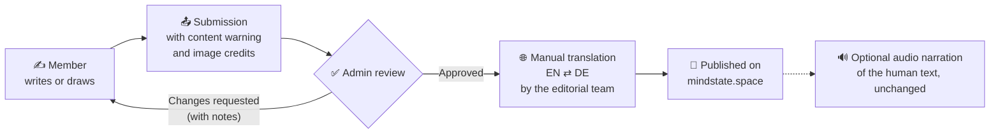

<div align="center">

# 🧠 MINDSTATE

### Honest conversations about mental health, culture and being human

A student-led, members-only editorial community where people share **articles** and **art** in **English and German**.

<br>

[](https://mindstate.space)
[](#-translation-and-audio)
[](https://www.djangoproject.com/)
[](https://www.python.org/)
[](LICENSE)
[](#-contributing)

<br>

[**🌐 Visit the site**](https://mindstate.space) · [**🛣️ Roadmap**](#%EF%B8%8F-upcoming-features) · [**🤝 Contribute**](#-contributing) · [**💛 Get help now**](#-safety-and-helplines)

</div>

<br>

> [!IMPORTANT]
> **MindState is not therapy, diagnosis or an emergency service.** Nothing published here replaces professional help.
> If you or someone you know is in danger or crisis, please contact your **local emergency number** right away (112 in Germany and India). More helplines are listed under [Safety and helplines](#-safety-and-helplines).

---

## 📑 Table of contents

- [About MindState](#-about-mindstate)
- [What you can do today](#-what-you-can-do-today)
- [Contribution rules at a glance](#-contribution-rules-at-a-glance)
- [Translation and audio](#-translation-and-audio)
- [Design system](#-design-system)
- [Tech stack](#-tech-stack)
- [How it works](#%EF%B8%8F-how-it-works)
- [Getting started](#-getting-started)
- [Project structure](#%EF%B8%8F-project-structure)
- [Upcoming features](#%EF%B8%8F-upcoming-features)
- [Contributing](#-contributing)
- [Core tech team](#-core-tech-team)
- [Code of conduct](#-code-of-conduct)
- [Safety and helplines](#-safety-and-helplines)
- [License](#-license)
- [Acknowledgements](#-acknowledgements)

---

## 🌿 About MindState

**MindState** ([mindstate.space](https://mindstate.space)) is a community publishing platform for writing and art about mental health, culture and society. Members publish essays, personal essays, poems, fiction and lifestyle pieces, alongside visual art posts, in **English and German**.

Every piece is reviewed by people before it goes live, every translation is done by hand, and every contributor has the right to stay anonymous. The platform is built in the open, **collaboratively, by everyone in the MindState community**.

| 💬 Honest | 🫶 Safe | 🌍 Bilingual | 🤝 Collaborative |
| :---: | :---: | :---: | :---: |
| Real stories in plain, sincere words | Content warnings, human review and the right to anonymity | English and German, translated manually by the editorial team | Writers, artists, editors and developers build it together |

---

## ✨ What you can do today

These features are **live on [mindstate.space](https://mindstate.space)**:

| Feature | Description |
| --- | --- |
| 🔐 **Members-only access** | The editorial site sits behind a member login. |
| 📝 **Articles** | Essays, personal essays, poems, fiction and lifestyle pieces in English and German, with content warnings. |
| 🖼️ **Art posts** | Curated art collections with credited, openly licensed image galleries. |
| 🔎 **Search** | Search by tag, author and language, with filter chips (for example, art only). |
| ⭐ **Discovery** | *Editor's Top Picks*, *Recently Added* and related content on every post. |
| 👥 **Community directory** | An A–Z members directory with search, role filters and sorting. |
| ℹ️ **About** | Who we are, plus *Contact us* and *Get involved* sections. |
| 🛠️ **Staff admin** | Django admin for authorised staff. |

> [!NOTE]
> There is no EN/DE language toggle yet. German pieces are published as separate entries and tagged by language. A toggle is on the [roadmap](#%EF%B8%8F-upcoming-features).

---

## 📜 Contribution rules at a glance

The full rules live in the **MindState Community & Contribution Guidelines**. Here is the short version:

| # | Rule |
| :---: | --- |
| 1 | ✍️ **Own work only.** No one may publish an article or artwork that isn't their own. |
| 2 | 🕶️ **Right to anonymity.** Publish under your name, a pen name or anonymously. Never try to identify an anonymous author. |
| 3 | 🖍️ **Hand-drawn illustrations only.** AI may be used *only* to digitise a drawing, without drastic change. |
| 4 | 🖼️ **Openly licensed images only**, always credited with a link to the source. |
| 5 | 🔢 **Max 5 images per post**, with exactly **1 featured** image on articles. |
| 6 | 🎨 **Art posts:** every image gets a description and its meaning. |
| 7 | 🌐 **Every illustration's meaning** is explained in English or German and translated into the other language **manually by the editorial team**. |
| 8 | 🚫 **No AI, Google Translate or similar services** for translation. |
| 9 | ⚠️ **Content warnings** are required on every submission. |
| 10 | ✅ **Human review.** Admins approve or disapprove every submission and add notes explaining what needs to change. |
| 11 | 👤 **Member profiles** are mandatory for everyone who posts. Photos are optional. |

<details>
<summary><b>🖍️ Illustrations for the platform</b></summary>

<br>

Members can draw illustrations for different sections and areas of the platform (page headers, section dividers, empty states and small spot illustrations) to make MindState **playful and good looking**.

- The same rule applies: **hand-drawn by people**, and AI only to digitise them without drastic change.
- Each illustration's meaning is explained in English or German and translated manually by the editorial team.
- The artist is credited by name, pen name or anonymously.
- Platform illustrations are **not posted like articles or art posts**. They go on their own **Illustrations contribution page** (an [upcoming feature](#%EF%B8%8F-upcoming-features)), where admins review them and choose where each one is placed.

</details>

<details>
<summary><b>📤 How to submit an article or art post</b></summary>

<br>

**Articles**

1. Complete your member profile (name or pen name and a short bio; photo optional).
2. Choose the type and the language (English or German). Add a title, a short summary and your text, in your own words.
3. Add a content warning (write "None" only if truly none applies).
4. Add up to 5 images, mark exactly 1 as featured, and add the source link and licence for every image.
5. Choose to publish under your name, a pen name or anonymously, tick the consent and licence checkbox and submit.
6. Respond to admin notes if changes are requested. After approval, the editorial team arranges the manual translation.

**Art posts**

1. Complete your member profile.
2. Upload up to 5 images of your work. Illustrations must be hand-drawn.
3. For each image, write a description and its meaning in English or German.
4. Add a content warning, tick the consent and licence checkbox and submit. The editorial team translates your descriptions manually before publication.

You keep ownership of your work.

> The online submission flow and status tracker are not built yet. Until they launch, the MindState editorial team submits and tracks your piece with you. The rules apply now.

</details>

---

## 🌐 Translation and audio

> [!WARNING]
> **Translation is human-only.** Articles, art descriptions and illustration meanings must **not** be translated with AI, Google Translate or similar services. The MindState editorial team translates everything manually, in both directions (EN → DE and DE → EN). Where possible, a second editor checks the translation, and the author may review it.

**🔊 The one exception is audio.** Online services (for example, Google text-to-speech) may be used **only for voice narration**, and **only on text the editorial team has written or translated manually**. The text is read exactly as published, **without any changes**. These services must never translate, rewrite, summarise or edit anything.

---

## 🎨 Design system

The live site at [mindstate.space](https://mindstate.space) is the official MindState design system. Reuse its colours, fonts, radii and CSS variables, and don't add new ones without review from the core team.

### 🔤 Typography

| Font | Used for | Weights | Licence |
| --- | --- | --- | --- |
| [**Google Sans Flex**](https://fonts.google.com/specimen/Google+Sans+Flex) | Body text and all UI | 400 · 500 · 600 | [SIL Open Font License 1.1](https://fonts.google.com/specimen/Google+Sans+Flex/license) |
| [**Instrument Serif**](https://fonts.google.com/specimen/Instrument+Serif) | Display headings, the MINDSTATE wordmark and italics | 400 | [SIL Open Font License 1.1](https://fonts.google.com/specimen/Instrument+Serif/license) |

Both fonts are open source and free to use.

### 🎨 Colour palette

| Swatch | Name | Hex | Typical use |
| :---: | --- | --- | --- |
|  | **Cream** | `#FEF0D8` | Main page background |
|  | **Warm dark** | `#292021` | Dark panels, pill buttons, footer |
|  | **Forest green** | `#28513B` | Accent colour |
|  | **Logo yellow** | `#F2B83B` | Logo |
|  | **Paper beige** | `#E9DDC8` | Art paper and soft surfaces |

<details>
<summary><b>More tokens and shapes</b></summary>

<br>

| Token | Value |
| --- | --- |
| Ink | `#060606` |
| Off-white (text on dark) | `#F6F6F6` |
| Muted taupe | `#C7B9A5` |
| Reading text | `#514B43` |
| Corner radii | `12px` · `14px` · `24px` · `28px` · `32px`, and full pills |
| Breakpoints | `540px` · `768px` · `900px` · `1100px` |

- **Shapes:** dark pill buttons, outline pills, rounded dark panels and borderless image cards.
- **Case:** uppercase for navigation, eyebrows and footer links. Titles use sentence case.
- **Tone:** warm, student-led, sincere and plain.

</details>

---

## 🧱 Tech stack

| Layer | Technology |
| --- | --- |
| 🐍 Language | [Python](https://www.python.org/) 3.12+ |
| 🌐 Web framework | [Django](https://www.djangoproject.com/) 6.1 (server-rendered templates, Django auth and admin) |
| 🗄️ Database | SQLite (Django ORM and migrations) |
| 🎨 Frontend | Django templates, hand-written CSS and vanilla JavaScript |
| 📦 Static files | [WhiteNoise](https://whitenoise.readthedocs.io/) with Brotli compression |
| 🚀 App server | [Gunicorn](https://gunicorn.org/) |
| 🔤 Fonts | Google Fonts: Google Sans Flex and Instrument Serif |
| 🧑‍💻 Collaboration | GitHub (issues, branches and pull requests) |

---

## 🗺️ How it works



---

## 🚀 Getting started

### Prerequisites

- Python **3.12 or newer**
- Git

### Installation

```bash
# 1. Clone the repository
git clone https://github.com/rudranshshuklaofficial/mindstate-v1.2.git
cd mindstate-v1.2

# 2. Create and activate a virtual environment
python3 -m venv .venv
source .venv/bin/activate        # Windows (PowerShell): .\.venv\Scripts\Activate.ps1

# 3. Install dependencies
pip install -r requirements.txt

# 4. Apply database migrations
python manage.py migrate

# 5. Create a local account so you can log in
python manage.py createsuperuser

# 6. Start the development server
python manage.py runserver
```

Then open **http://127.0.0.1:8000** and log in with the account you just created. The editorial pages are members-only, so you'll be sent to the login page first.

<details>
<summary><b>📚 Content library commands</b></summary>

<br>

The repository includes the starting library of articles and art posts, plus management commands to validate and import it:

| Command | What it does |
| --- | --- |
| `python manage.py import_article_library` | Validates the supplied articles. Add `--replace-demos` to replace demo content with the library. |
| `python manage.py import_art_library` | Validates the art posts and their images. Add `--install` to import or update them. |
| `python manage.py load_landing_samples` | Loads the original home page cards as sample content. |
| `python content/verify_article_library.py` | Compares rendered articles with the original source documents. |

</details>

<details>
<summary><b>🧭 Main routes</b></summary>

<br>

| Route | Page |
| --- | --- |
| `/` and `/app/` | Home |
| `/app/article/<id>/` | Article |
| `/app/art/<slug>/` | Art post |
| `/app/search/` | Search (for example, `?section=art`) |
| `/about/` | About, Contact us and Get involved |
| `/community/members/` | Community members directory |
| `/accounts/login/` | Member login |
| `/admin/` | Django admin (authorised staff only) |

</details>

---

## 🗂️ Project structure

```text
mindstate-v1.2/
├── alpha/                  # Main Django app: models, views, admin, community directory
│   ├── management/
│   │   └── commands/       # import_article_library, import_art_library, load_landing_samples
│   └── migrations/         # Database migrations
├── content/                # Article and art libraries, fixtures, source documents and guides
├── static/                 # CSS, JavaScript and images (incl. articles/ and art-posts/)
├── templates/              # Django templates (home, article, search, about, auth, community)
│   ├── article-content/    # Article body templates
│   └── article-credits/    # Image credit templates
├── web/                    # Project settings, URLs, WSGI and ASGI
├── manage.py               # Django command-line entry point
└── requirements.txt        # Python dependencies
```

---

## 🛣️ Upcoming features

> These features are **not built yet**. They form a roadmap that **the whole MindState community builds together**. The contribution rules apply now. Until a feature launches, the editorial and admin teams handle that step directly.

**Community**

- [ ] 👤 Member profiles and personal dashboards with views and stats
- [ ] 📤 Submission flow and status tracker (Draft → Submitted → In review → Changes requested → Approved → Published)
- [ ] ✅ Admin review dashboard to approve or disapprove with notes
- [ ] 💬 Feedback & Requests space for bugs, feature ideas and topic requests
- [ ] 🤝 Collaboration space for artists and writers, with dual credit
- [ ] 🖍️ Illustrations contribution page for platform illustrations

**Reading and accessibility**

- [ ] 🌐 EN/DE language toggle that switches to the human translation
- [ ] ⏱️ Reading time on every post
- [ ] 🔊 Audio version, narrating only human-written or human-translated text, unchanged

**Safety and trust**

- [ ] 🆘 Crisis resources bar with helplines
- [ ] 🧾 Image licence checker
- [ ] 📊 Privacy-friendly analytics (Plausible or Umami)

Want to pick one up? Start with the [contributing workflow](#-contributing) below.

---

## 🤝 Contributing

Everyone is welcome: developers, designers, writers, artists, translators and editors. All tech work happens through **GitHub**.

### Workflow

1. **🔍 Open or pick an issue.** Check existing issues first. To propose something new, describe the problem, the idea and the rule or roadmap item it supports.
2. **💬 Discuss it with the core tech team** in the issue, and agree the scope before writing code.
3. **🌱 Create a branch** from `main` using a prefix from the table below.
4. **🧪 Make small, focused commits**, and run the checks and tests locally.
5. **📬 Open a pull request** with a clear description and **screenshots for any visual change**.
6. **👀 Get a review.** At least one core tech team member must approve before merging.

| Prefix | Use for | Example |
| --- | --- | --- |
| `feature/` | New features | `feature/submission-tracker` |
| `fix/` | Bug fixes | `fix/search-filter-chips` |
| `docs/` | Documentation | `docs/contributing-guide` |
| `chore/` | Maintenance and tooling | `chore/update-dependencies` |
| `hotfix/` | Urgent production fixes (core team only) | `hotfix/login-redirect` |

> [!CAUTION]
> **No direct pushes to `main`.** Every change reaches `main` through a pull request reviewed and approved by the core tech team. Turn on two-factor authentication (2FA) on your GitHub account, and never commit secrets.

<details>
<summary><b>✅ Pull request checklist</b></summary>

<br>

- [ ] Branch uses the correct prefix
- [ ] Linked to an issue agreed with the core tech team
- [ ] Checks and tests pass locally
- [ ] Screenshots attached for visual changes
- [ ] Follows the MindState design system
- [ ] No secrets or personal data committed
- [ ] Database changes made only through Django migrations

</details>

Not a developer? You can still help by sharing ideas and feedback and by testing new features before they launch.

---

## 👥 Core tech team

MindState has **one core tech team of up to 8 members**, each with a clearly defined role. The team reviews every pull request and looks after the platform at all times, working closely with the MindState administration team.

<details>
<summary><b>Suggested roles (to be confirmed by the core team)</b></summary>

<br>

| # | Role | Focus |
| :---: | --- | --- |
| 1 | Tech Lead / Platform Lead | Technical direction, architecture and releases |
| 2 | Backend Lead | Data models, Django admin and migrations |
| 3 | Frontend Lead | Templates, styling and responsive behaviour |
| 4 | Design System & UX Lead | Visual consistency and accessibility |
| 5 | DevOps & Release Manager | Hosting, deployments, backups and monitoring |
| 6 | Security & Privacy Lead | Security reviews, GDPR and access control |
| 7 | QA & Accessibility Lead | Testing, accessibility checks and bug triage |
| 8 | Community Tech Liaison | Onboarding new contributors and linking teams |

</details>

---

## 💛 Code of conduct

- 🫶 **Be kind and constructive** in comments, reviews and collaborations.
- 🕶️ **Respect anonymity.** Never try to identify an anonymous author.
- ⚠️ **Handle sensitive topics responsibly.** Use content warnings and avoid graphic descriptions of methods of self-harm or suicide. Focus on experience, recovery, support and hope.
- 🚫 **Zero tolerance** for harassment, hate speech, plagiarism, AI-generated illustrations or machine-translated text.
- 🔒 **Report security issues privately** to the core tech team, not in public issues.

Breaches may lead to a request for changes, removal of content, suspension or removal from MindState. Decisions can be appealed once.

---

## 🆘 Safety and helplines

If you need help now, please reach out. You don't have to go through it alone.

| Country | Service | Contact |
| --- | --- | --- |
| 🇩🇪 Germany | TelefonSeelsorge (free, 24/7) | 0800 111 0 111 / 0800 111 0 222 / 116 123 |
| 🇩🇪 Germany | Emergency | 112 |
| 🇮🇳 India | Tele-MANAS (free, 24/7) | 14416 / 1-800-891-4416 |
| 🇮🇳 India | Emergency | 112 |

Elsewhere, please call your **local emergency number**. Helpline numbers are checked regularly by the core team.

---

## 📄 License

The source code in this repository is released under the **[MIT License](LICENSE)**.

Articles, art and illustrations published on MindState belong to their creators. Images used on the platform are openly licensed and credited to their original sources.

---

## 🙏 Acknowledgements

- 💛 Every **writer, artist, translator and editor** who shares their work and time with MindState
- 🏛️ [Wellcome Collection](https://wellcomecollection.org/) and [The Metropolitan Museum of Art](https://www.metmuseum.org/) for their public-domain collections
- 📷 [Unsplash](https://unsplash.com/) photographers for openly licensed photography
- 🔤 [Google Fonts](https://fonts.google.com/) for Google Sans Flex and Instrument Serif
- 🐍 The [Django](https://www.djangoproject.com/) community
- 🏷️ [Shields.io](https://shields.io/) for the badges

<br>

<div align="center">

**Made with care by the MindState community** 🌱

[mindstate.space](https://mindstate.space)

</div>
